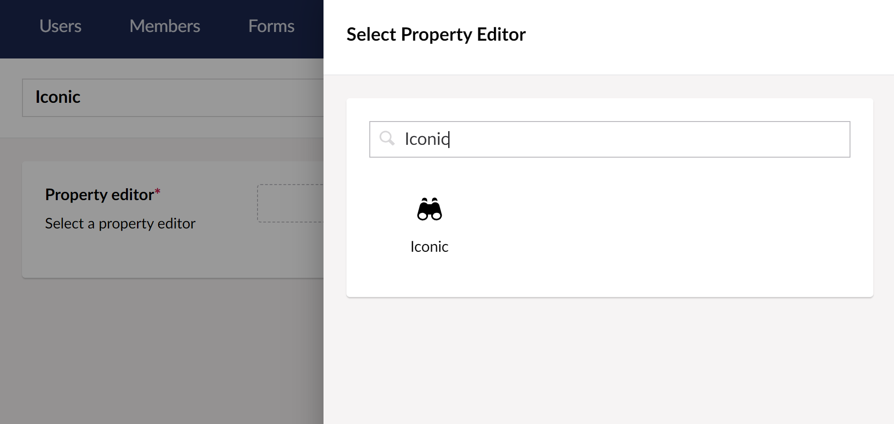
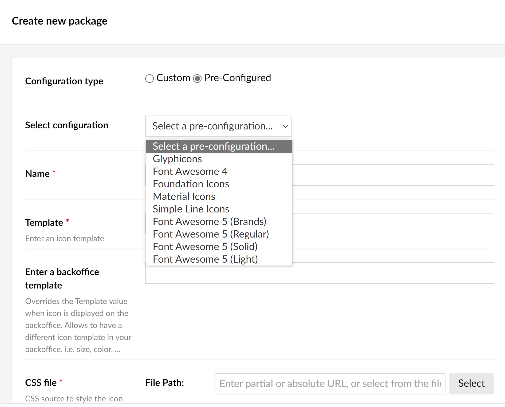

# Iconic Configuration


## Create a new DataType
You have to create a new datatype from the Iconic editor:
1. Go to the Developer section.
2. Right click on *DataTypes*, click *Create* and click on *New data type*.
3. Enter a name for your datatype and select Iconic from the *Property Editor* dropdown.



At this point I would recommend you to save your datatype as the configuration can take a bit of trial an error as you will need to deal with some regex and urls.

## Iconic Configuration Basics
On the Packages Configuration property, click the Add button. This will display a new form that you will use to configure your new font package.
1. Enter the name for your package
2. Create your selector. This will use regex to extract your icons css from the font package.
3. Source file path. This file will contains the specific configuration for each icon.
   To extract the rules the previous regex rule will be used. This file will normally be a CSS file where the rules are contained. You can use absolute or relative paths. See below.
4. Path to your font package css file.
    * You can use absolute paths: http:\\www.yoursite.com\styles\fonts\my-font-package.css. This allows you to use external files, like the ones from a CDN.
    * Or relative to the root: \styles\fonts\my-font-package.css
    This file will be loaded in the head of your backoffice and will affect the whole view so be careful of what you load there. Check the Known Issues section for some more info.

5. Template. This will be the template your icon will be based on. You can use the value ```{icon}``` as placeholder for your icon specific rule. For instance, for Font Awesome you should enter something like: `<i class="fa {icon}"></i>`
6. Override Backoffice template. Optional. You can override the Template value to use differente templates for frontend and backoffice.
6. Click *Add Package* to add the configuration to your packages listing. Before adding the package, Iconic will extract the css rules from the file using the regex selector. Some checking is ran that will let you know if something went wrong with your configuration.

### Template Placeholders
You can use the following placeholders to customize the way your icon is rendered in the frontend:
- *\{icon\}* : Here is where the specific icon rule will be included. For instance, for a Font Awesome icon you would do ```<i class="fa {icon}"></i>```
- *\{classes\}*: You can add extra classes to your icon from your views. See [Displaying the Icon](../Usage/readme.md#displaying)
- *\{attributes}*: You can use this placeholder to add extra attributes to your icon from your views. This can be useful to add data attributes for instance among other things. See [Displaying the Icon](../Usage/readme.md#displaying)

### Icons source file
This file will be used to extract the specific configuration for each different icon.

For example, some packages like Font Awesome use css rules to apply the specific icon:
```
<i class="fa fa-glass"></i> (Template: <i class="fa {icon}"></i>)
```

Other packages like Material Icons use the glyph codes or even ligatures to display the icon instead a specific css selector. 
```
<i class="material-icons">alarm</i> (Template: <i class="material-icons">{icon}</i>)
```
So this file can be the same css file or another files use to extract the icons property. In the case of Material Icons for instance there is a file called <a href="https://github.com/google/material-design-icons/blob/master/iconfont/codepoints">codepoints</a> where you can extract the icons names from.


### Pre configured packages
To make your life easier I have included some help to configure your packages in the form of pre-configured packages. If you select *Pre-Configured* when creating your package, you will have access to a list of pre-configured ones. You will still have to enter your css file path.




You can add as many packages you like. You can also arrange their order or remove those you don't want to use anymore.

*Note*: the regex included in the preconfigs are valid for the **minimised versions** of them.

### Reviewing your configuration
Once you have added your configuration, this will be added to the configurations list. You add add as many as you want. To review the details of your configured package just click on them:


You will get a read-only list of your values. To edit them just click on the Edit Package option.

